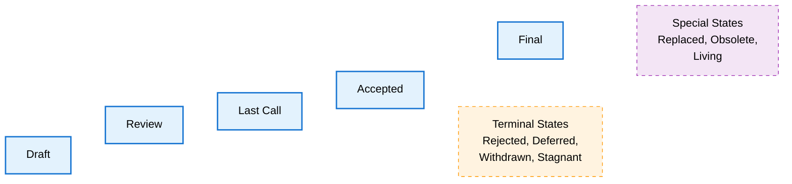

# BIT-0003: Extended BIT Lifecycle Process

- **BIT Number:** 0003
- **Title:** Extended BIT Lifecycle Process
- **Author(s):** Maciej Kula
- **Discussions-to:** https://discord.com/channels/1120750674595024897/1395831145827926137
- **Status:** Living
- **Type:** Meta
- **Created:** 2025-07-18
- **Updated:** 2026-04-13
- **Requires:** None

## Abstract

This BIT proposes extending the current BIT lifecycle with additional stages and type-specific pathways. The current lifecycle lacks important stages and treats all proposal types uniformly, which may lead to ambiguity and inefficient processing of different BIT types.

## Motivation

The current BIT lifecycle has several gaps that create confusion and inefficiency:

**Missing Lifecycle Stages:** We lack explicit stages for rejected proposals, deferred considerations, and superseded BITs. This creates ambiguity about proposal outcomes and makes it difficult to track why certain proposals are not active. (like many of the current ones)

**Uniform Treatment:** All BIT types currently follow the same lifecycle regardless of their scope and consensus requirements. A "Core" protocol change requiring broad consensus should follow a different path than an "Informational" BIT documenting best practices.

**Implementation Ambiguity:** The current lifecycle jumps directly from "Last Call" to "Final" without distinguishing between theoretical acceptance and practical implementation readiness.

## Specification

I propose adding these stages to the current lifecycle:

- **Rejected:** BIT has been formally rejected due to lack of consensus (or fundamental issues)
- **Deferred:** BIT lacks current consensus but may be reconsidered in the future
- **Replaced:** BIT has been superseded by a newer proposal
- **Obsolete:** BIT is no longer relevant due to changing circumstances
- **Accepted:** BIT has achieved consensus but is not yet implemented

The existing **Stagnant** and **Living** statuses are maintained in the new framework.

The revised lifecycle introduces these pathways:

- **Core/Subtensor BITs:** Draft → Review → Last Call → Accepted → Final
- **Interface/Networking BITs:** Draft → Review → Last Call → Accepted → Final
- **Meta/Informational BITs:** Draft → Review → Final

All BIT types can transition to: Rejected, Deferred, Withdrawn, Replaced, or Obsolete at appropriate stages.

## Rationale

This design addresses the gaps while maintaining backward compatibility with existing BITs. Separating acceptance from implementation (Accepted vs Final) provides clarity about proposal status.

Type-specific pathways recognize that different BIT categories have different consensus requirements and review needs.

## Backwards Compatibility

All existing BITs maintain their current status. The revised lifecycle applies to new BITs and existing BITs that undergo status changes. Current "Final" BITs remain Final.

## Reference Implementation

None

## Security Considerations

None

## Copyright

This document is licensed under [The Unlicense](https://unlicense.org/).
