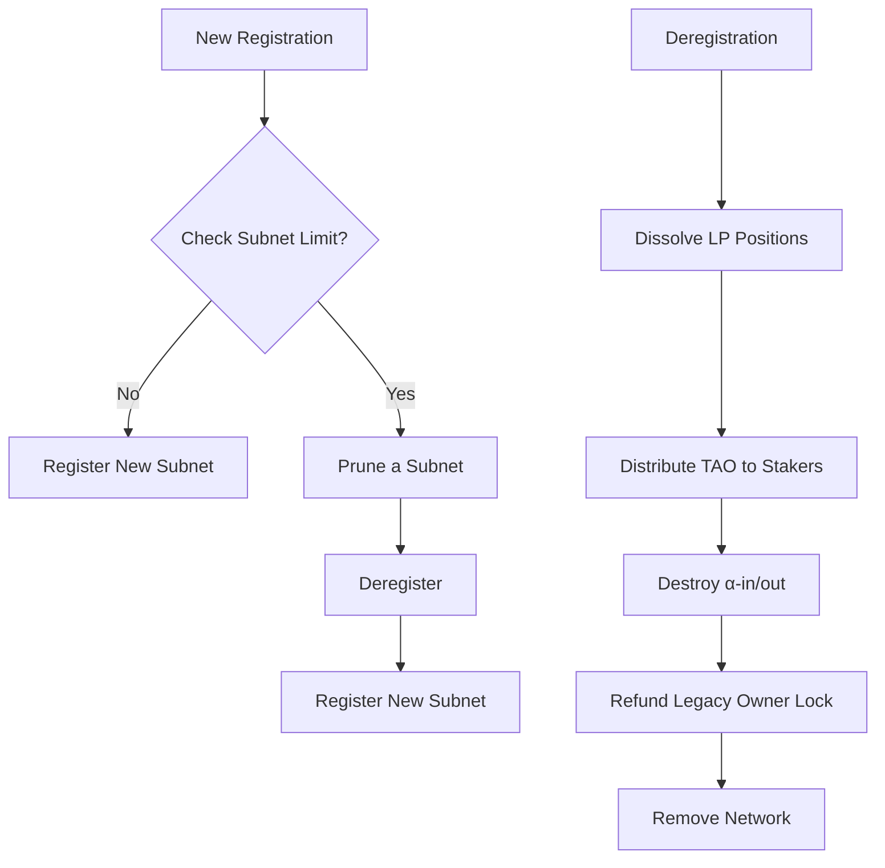

# BIT-0004: Subnet Deregistration

- **BIT Number:** 0004
- **Title:** Subnet Deregistration
- **Author(s):** John Spiigot, Greg Zaitsev
- **Discussions-to:** https://discord.com/channels/1120750674595024897/1346557046761324545
- **Status:** Final
- **Type:** Core
- **Created:** 2025-08-12
- **Updated:** 2026-04-13

## 🔍 Abstract

This BIT proposes reenabling of subnet deregistration.

## 🔧 Motivation

Since the DTAO launch, the non-functional subnets keep consuming emissions, as well as chain footprint and compute resources. The existing subnet deregistration (`dissolve_network` / `remove_network`) is no longer working correctly and is disabled.

## 🧪 Specification

### Subnet Pruning

Triggered when `SubnetLimit` is reached and a new subnet registration is attempted:
- **Step 1:** Exclude subnets still within `NetworkImmunityPeriod`
- **Step 2:** Among the rest, find the subnet with the lowest moving alpha price
- **Step 3:** If multiple share the same price, pick the one with the earliest registration timestamp

### Network Dissolution 

In `do_dissolve_network`, perform full DTAO cleanup in the following order:
1. Finalize all pending root dividends for the subnet
2. Dissolve all user liquidity provider positions and clear protocol liquidity
3. Distribute remaining subnet TAO pool to all stakers (α-in and α-out) pro-rata by alpha value, credited directly to coldkey free balances
4. Destroy all α-in and α-out stakes and share pool state
5. For legacy subnets (registered before `NetworkRegistrationStartBlock`): adjust the owner's returned lock cost by subtracting the portion of total emissions the owner received (`owner_received_emission = alpha_issuance * subnet_owner_cut * current_price`), so the final refund is `max(0, lock_cost - owner_received_emission)`. New subnets receive no lock refund.
6. Purge on-chain commitments for the subnet
7. Remove all network storage (parameters, neuron state, AMM data, mechanism config, etc.)

Both `dissolve_network` and `root_dissolve_network` extrinsics maintain root-only access.

### Explicit Subnet Limit
Add new sudo hyperparameter `SubnetLimit` starting at `128`.

### High-Level Flow

## © Copyright

This document is licensed under [The Unlicense](https://unlicense.org/).
