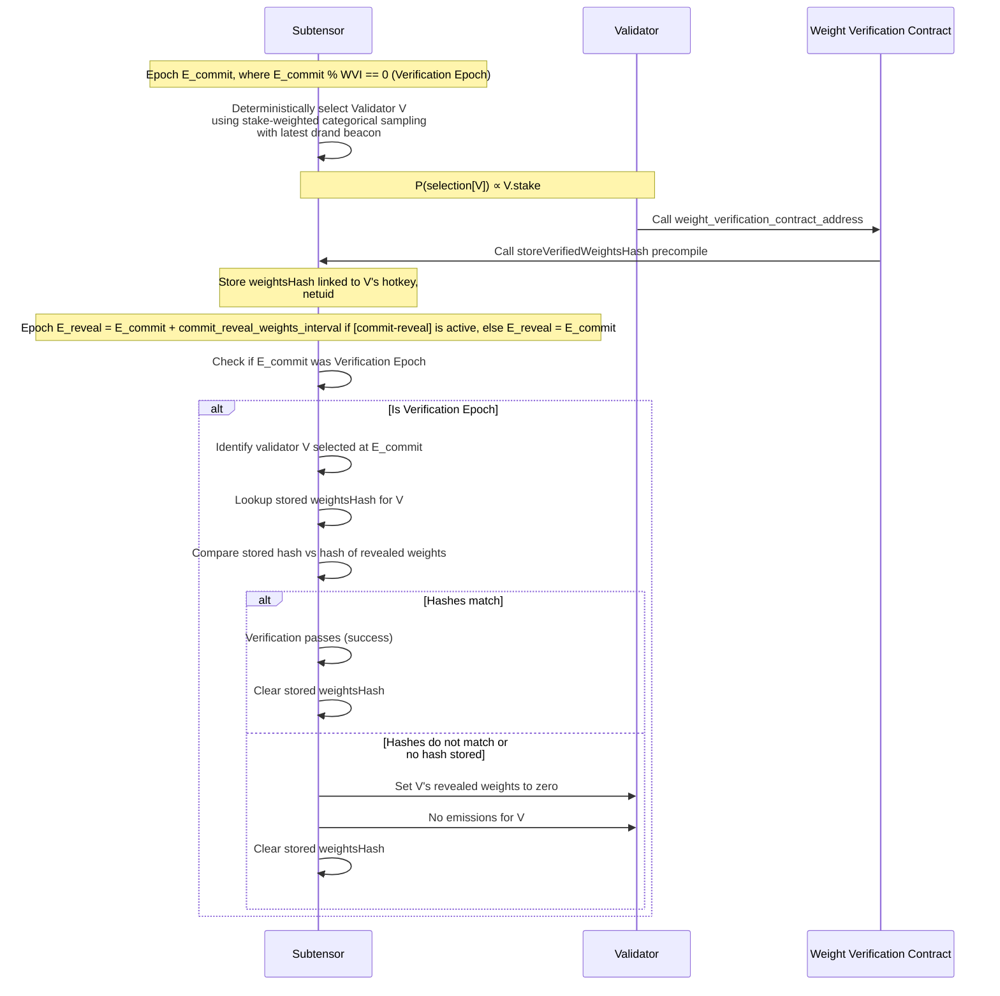

# BIT-0008: EVM Weight Verification

- **BIT Number:** 0008
- **Title:** EVM Weight Verification
- **Author(s):** Inference Labs (https://github.com/inference-labs-inc/)
- **Discussions-to:** [`#proof-of-weights`](https://discord.gg/4aHEVxVZMz)
- **Status:** Draft
- **Type:** Core, Subtensor
- **Created:** 2025-06-05
- **Updated:** 2025-06-13
- **Requires:** None
- **Replaces:** None

## Abstract

As a component of the broader Proof of Weights initiative, a mechanism is required to verify that validator weights submitted to the blockchain are valid per a subnet-owner-controlled verification contract.

## Motivation

One of the core components of the Bittensor network is the ability for subnet owners to incentivize miners within their subnets to perform useful work.

Currently, subnet owners have limited ability to ensure validators are operating as expected within their subnets. This is a critical issue for the ecosystem, as it undermines the security and reliability of the network for a number of reasons:

- Validators can submit invalid weights to the chain to sway incentives without transparency.
- Validators can copy consensus weights to gain emissions without performing any validation work.
- Validators can entirely diverge from a subnet's desired method of operation and effectively hijack the power of the network provided they reach [`kappa`] majority[^1]

> [^1]: Though solutions such as Yuma3 and Bonds Reset work to mitigate this risk, it remains a valid concern.
>
> Assuming a naive case where a copier uses a script to predict consensus, Yuma3+Bonds Reset can effectively remove the incentive to weight copy. Having this knowledge of copier behavior, subnet owners coordinate miner bonds resets with changes in validator incentive to disrupt the ability of copiers to predict scores in the next cycle.
>
> Without providing specific examples for security reasons — this strategy, though effective in its current form, is not robust against more sophisticated copier behavior.

Currently, over 7.5% of subnets face immediate risk from weight-copying attacks, with copier stake exceeding 40% in these networks. Without intervention, subnet owners lack effective tools to prevent malicious validators from overtaking [`kappa`] majority in their subnets through inflated dividends that influence stake centralization.

Uncontrolled weight copying creates three critical failure modes:

- **Misaligned emissions**: Miners receive rewards unrelated to actual performance, destroying the merit-based incentive structure that drives useful work.
- **Validator parasitism**: Copying validators accumulate excessive dividends after reaching [`kappa`] majority, creating a feedback loop that attracts more stake to parasitic behavior.
- **Downstream impacts**: Products relying on Bittensor lose reliability as a dishonest majority of validators creates a consensus that is not representative of the network's true state.

This BIT addresses these vulnerabilities by enabling subnet owners to deploy custom verification contracts that validate weight submissions before they affect consensus. The proposed optimistic verification mechanism maintains network security while minimizing on-chain computational overhead.

## Specification

This BIT contains the following specification sub-sections.

- [Hyperparameters](#hyperparameters)
- [Verification Logic](#verification-logic)
- [Precompile: Weight Verification Storage](#precompile-weight-verification-storage)
- [Optimistic Validity Verification](#optimistic-validity-verification)
- [Gas Fees](#gas-fees)

### Hyperparameters

This proposal introduces three new hyperparameters.
| Parameter | Scope | Access | Description |
| --- | --- | --- | --- |
| `weight_verification_contract_address` | per-subnet | subnet owner or root | The EVM address of the verification contract, set by the subnet owner. Setting this address enables the optimistic validity verification mechanism for that subnet. |
| `weight_verification_interval` | per-subnet | subnet owner or root | The interval in epochs between weight verifications, set by the subnet owner. This allows subnet owners to define the frequency of weight verifications, and to set it to a value that is appropriate for their subnet. |
| `weight_verification_gas_limit` | global | root only | A global gas limit for all subsidized verification transactions, set by root. This serves as a critical safeguard to prevent malicious or inefficient verification contracts from consuming excessive block resources. |

### Verification Logic

Subnet owners are responsible for deploying their own verification contracts to the EVM. These contracts can implement any arbitrary logic a subnet owner deems necessary to validate a validator's performance.

The core responsibility of a verification contract is to:

1.  Define a function, `verify(bytes calldata data)`, to receive verification data from a validator.
2.  Decode and process the `data` payload according to the subnet's specific requirements.
3.  Perform the verification logic.
4.  If verification is successful, calculate the `keccak256` hash of the weights being verified. If unsuccessful, revert the transaction at this step.
5.  Call the `storeVerifiedWeightsHash` precompile with the subnet's `netuid` and the calculated `weightsHash`.

The proposed interface for the verification contract is as follows:

```solidity
interface IVerificationContract {
    function verify(bytes calldata data) external;
}
```

An example of a minimal verification contract is provided in the [Reference Implementation](#reference-implementation) section.

### Precompile: Weight Verification Storage

To create a robust and gas-efficient bridge between the EVM verifier and the Subtensor pallet, this proposal introduces a new precompile. Precompiles allow the EVM to call directly into the Substrate runtime's native logic, avoiding brittle and slow event-querying mechanisms.

- **Address:** A new, unoccupied address on the EVM, e.g., `0x...`.
- **Function:** The precompile exposes a single function:
  ```solidity
  function storeVerifiedWeightsHash(uint16 netuid, bytes32 weightsHash) external returns (bool);
  ```
- **Security Model:** The precompile enforces a strict security policy. A call to `storeVerifiedWeightsHash(netuid, ...)` is only valid if:
  1. The `msg.sender` of the precompile call is the registered `weight_verification_contract_address` for the given `netuid`.
  2. The `origin` of the EVM transaction (the validator's hotkey) is the validator that was selected for verification in the current epoch for that `netuid`.
- **Action:** If the call is valid, the precompile writes the `weightsHash` into a new Subtensor storage item: `VerifiedWeightHashes: map (u16, T::AccountId) -> H256`. This maps the `netuid` and the validator's hotkey (`origin`) to the provided hash.

### Optimistic Validity Verification



This mechanism uses the precompile to create a simple, state-based verification process that integrates cleanly into the existing `epoch()` function. The process is governed by the `weight_verification_interval` (WVI).

The logic unfolds across two key moments: the **Commit Epoch**, when the verification task is assigned and the proof is submitted, and the **Reveal Epoch**, when the committed weights are revealed and verified against the proof.

#### Step 1: Commit & Prove (Epoch `E_commit`)

This step occurs during a designated "Verification Epoch".

- **When:** An epoch `E_commit` where `E_commit % WVI == 0`.
- **Action 1: Validator Selection**
  - At the start of the epoch, Subtensor deterministically selects one validator `V` using stake-weighted categorical sampling with the latest drand beacon. The probability of selection `P(V)` is proportional to the validator's stake `S(V): P(V) = S(V)/S_total`. This stake-weighted selection ensures validators with higher influence and responsibility in the network face proportionally higher verification requirements, creating a natural alignment between economic power and security obligations.
  ```rust
  // Categorical sampling weighted by stake
  let total_stake: f64 = S.iter().sum();
  let random_value = (drand::random(b"validator_selection").0 as f64 / u64::MAX as f64) * total_stake;
  let mut cumulative = 0.0;
  for (i, &s) in S.iter().enumerate() {
      cumulative += s;
      if random_value < cumulative { return i as u16; }
  }
  ```
- **Action 2: Proof Submission**
  - The selected validator `V` must, within this epoch, call the `verify()` function of the subnet's `weight_verification_contract_address`.
  - The contract executes its owner-defined logic and calls the `storeVerifiedWeightsHash` precompile if verification is successful. This stores the `weightsHash` in Subtensor storage, linked to `V`'s hotkey and the `netuid`.

#### Step 2: Reveal & Verify (Epoch `E_reveal`)

This step occurs when the weights from the Commit Epoch are revealed.

- **When:** An epoch `E_reveal` where `E_reveal = E_commit + commit_reveal_weights_interval` if [commit-reveal] is active, else `E_reveal = E_commit`.
- **Action 1: Verification Trigger**
  - In the `epoch()` function, Subtensor checks if the corresponding `E_commit` was a Verification Epoch. If so, it proceeds.
- **Action 2: Weight Verification**
  - Subtensor identifies the validator `V` that was selected during `E_commit`.
  - It looks up the `weightsHash` stored for `V`.
  - It compares the stored hash against a new hash of the current weights for `V`.
- **Action 3: Consequence**
  - **Success:** If the hashes match, verification passes. The stored hash is cleared.
  - **Failure:** If no hash was stored or the hashes do not match, validator `V` fails. Their revealed weights for `E_commit` are ignored (`W[V].fill(0)`), and as a result they receive a significant penalty to emissions. The stored hash is cleared.

<details><summary>Expand to view simulated results</summary>


</details>

If `E_commit` was not a Verification Epoch, these steps are skipped.

> [!NOTE]
> The penalty is applied directly to validator weights by zeroing them out, rather than modifying derived values like ranks or trust. This ensures that unverified weights are completely ignored by the network, as they provide no value without verification. The validator effectively becomes a non-participant for that epoch, which is the most direct and logical consequence of failing verification.

This model operates independently of the [commit-reveal] interval and ensures that validators can only be required to prove weights that have been fully revealed and are available for cross-checking by Subtensor.

### Gas Fees

A critical design consideration is how to handle gas fees for the `verify` transaction without creating a "tax on honesty" for validators. Two primary models were considered: a "Subnet Owner Pays" model and a "Network Subsidy" model.

The "Subnet Owner Pays" model, while economically ideal for the chain, would require a native gas sponsorship feature in the [frontier] pallet, a significant and complex undertaking outside the scope of this proposal. Additionally, this model would levy a tax on honesty for subnet owners, disincentivizing them from adopting this verification mechanism.

Therefore, this BIT proposes a tightly-scoped **Network Subsidy model**. The core idea is to treat the single verification call per subnet per epoch as a marginal operational cost absorbed by the network's validators, in exchange for the overall security and integrity this mechanism provides.

To prevent abuse of this subsidy (e.g., a subnet owner deploying a computationally expensive contract to cause extreme load on the chain), we introduce a crucial safeguard: a new global root-only hyperparameter, `weight_verification_gas_limit`. Any subsidized transaction must have a gas limit below this value. This ensures that even a malicious contract cannot consume excessive block resources.

The proposed initial value for `weight_verification_gas_limit` is 1,000,000 gas (~1.3% of the block space). This is a reasonable starting point based on the block limit of `75,000,000` gas, and a simulated large verification transaction consuming `500,000` gas. This can be adjusted as needed.

Pseudocode for the full validation logic is as follows:

```rust
pub fn is_subsidized_verification_call(
    transaction: &EthereumTransaction,
    current_epoch: u64,
) -> bool {
    // 0. Check if the transaction's gas limit exceeds the network's maximum for subsidized calls.
    // This is a critical safeguard against gas-bombing attacks.
    if transaction.gas_limit() > Self::get_weight_verification_gas_limit() {
        return false;
    }

    // 1. Ensure the transaction is a call to a contract.
    let to_address = if let Some(addr) = transaction.to() { addr } else { return false; };

    // 2. Check if the function selector matches `IVerificationContract.verify(bytes)`.
    // keccak256("verify(bytes)")[0..4] = 0xab2f7267
    let verify_selector: [u8; 4] = [0xab, 0x2f, 0x72, 0x67];
    if transaction.input().len() < 4 || &transaction.input()[0..4] != &verify_selector {
        return false;
    }

    // 3. Look up the subnet associated with the verification contract address.
    if let Some(netuid) = Self::weight_verification_contract_map(to_address) {
        // A. Check if the current epoch is a verification epoch for this subnet.
        // The WVI must be greater than zero to enable verification.
        let wvi = Self::get_weight_verification_interval(netuid);
        if wvi == 0 || current_epoch % wvi != 0 {
            return false;
        }

        // 4. This is a call to a known verification contract. Now check the sender for the *current* epoch.
        if let Some(selected_validator) = Self::get_selected_validator_for_epoch(netuid, current_epoch) {
            // 5. Is the sender the validator who was actually selected for this task?
            if transaction.from() == selected_validator {
                // 6. Have they already used their subsidy for this epoch?
                // This prevents replay attacks within the same epoch.
                if !Self::has_validator_submitted_verification(netuid, current_epoch, &selected_validator) {
                    // Mark as submitted and allow the gasless transaction.
                    Self::mark_validator_verification_submitted(netuid, current_epoch, &selected_validator);
                    return true;
                }
            }
        }
    }

    // If any check fails, it is not a valid subsidized call.
    false
}
```

> [!NOTE]
> An example of gasless transactions can be found here https://github.com/futureversecom/trn-frontier/blob/b7183775ad8177f7ea8c597707b47b09c884a852/primitives/evm/src/validation.rs#L80 and here https://github.com/polkadot-evm/frontier/issues/849

The potential chain load from this subsidy is minimal. With 256 subnets and a 361-block epoch (~72 minutes), this averages to less than one subsidized transaction per block assuming a `weight_verification_interval` of 1 epoch, an acceptable load for the security gained. A more complex gas sponsorship model can be revisited in a future BIT if necessary.

Chain size impact to archive nodes is modelled as follows. Assuming worst-case conditions:

- 256 subnets
- All subnets have a `weight_verification_interval` of 1 epoch
- All subnets have a `weight_verification_contract_address` set
- All subnets require a very large (21kb) zero knowledge proof to be submitted to the EVM for verification

In 30 days, this would result in a 3.2 GB increase in archive node storage. Over a year, this would result in a 38.4 GB increase in archive node storage. Assuming a more realistic scenario where only 50% of subnets (128 total) adopt this mechanism, and an average `weight_verification_interval` of 10 epochs, this would result in a 1.9 GB increase in archive node storage over one full year.

<details><summary>Expand to view simulated results</summary>


</details>

## Rationale

To enable the implementation of Proof of Weights ([BIT-0002]), several potential designs were considered. A summary of those considerations is provided below with explanations for why they were not chosen and why the proposed design was chosen.

### Native Rust / Pallet Implementation

This was the initial design considered for the implementation of the Proof of Weights ([BIT-0002]) mechanism. The idea was to implement the proof verifier within the Subtensor pallet and to require proof submissions along with each weight submission extrinsic.

This concept was abandoned due to the following reasons:

- Chain load. Each weight submission would require a proof submission, which would result in a significant increase in on-chain load, both in terms of storage and computational resources.
- Rigidity of implementation. The proof verifier would operate using a fixed proof system and no flexibility is provided to the subnet owner to define their own verification logic (such as metagraph-input cross-checking)
- Maintainability. Updating the verifier would require a new pallet release, which would require a new release of the Subtensor node and migration of subnet-owner submitted circuits, which would be a massive and unavoidable undertaking.

### EVM-based Non-Optimistic Implementation

The next design considered was to allow subnet owners the ability to define contracts that are deployed to the EVM as dedicated weight-setting contracts. The concept here is that all validators would submit their weights through this contract, which could include additional verification mechanisms.

This concept was also abandoned due to the following reasons:

- Chain load. Each weight submission would require a smart contract call, incurring a gas cost and evm processing overhead. If all subnets were to enable this mechanism, the transaction volume and block weight could overload the EVM and necessitate complex L2 scaling solutions.
- Gas fee management. Since calls to these contracts would incur fees, a complex subsidy-based system where the subnet owner covers this cost would be required, introducing a barrier to adoption along with increased development and maintenance overhead.

## Backwards Compatibility

This is fully backwards compatible with the current system.

## Reference Implementation

Below is a minimal reference implementation of a verification contract in Solidity. This contract demonstrates how a subnet owner could implement the required `verify` function, decode a simple payload, calculate the weights hash, and call the Subtensor precompile.

```solidity
// SPDX-License-Identifier: Unlicense
pragma solidity ^0.8.19;

// Interface for the Subtensor precompile
interface ISubtensorWeightVerification {
    function storeVerifiedWeightsHash(uint16 netuid, bytes32 weightsHash) external returns (bool);
}

/**
 * @title MinimalVerificationContract
 * @author Inference Labs
 * @notice This is a minimal reference implementation for a BIT-0008 weight verification contract.
 * It demonstrates the basic requirements: a `verify` function that decodes a payload,
 * hashes the relevant data (weights), and calls the Subtensor precompile.
 *
 * It assumes a simple data payload where a validator submits a list of UIDs and their
 * corresponding weights. The contract calculates the Keccak256 hash of the tightly packed
 * UIDs and weights and stores it via the precompile.
 *
 * NOTE: This is a minimal example. A real-world contract would likely include more
 * complex logic, such as role-based access control (RBAC) to restrict who can call `verify`,
 * and more sophisticated data validation such as zk-proof verification (BIT-0002).
 */
contract MinimalVerificationContract is IVerificationContract {
    // The address of the Subtensor precompile for storing verified weight hashes.
    // This will be a fixed, documented address provided by the OpenTensor Foundation.
    address public constant SUBTENSOR_PRECOMPILE_ADDRESS = 0x...; // TBD Address

    // The netuid this verification contract is for.
    uint16 public immutable i_netuid;

    // Interface to interact with the precompile.
    ISubtensorWeightVerification internal immutable i_subtensor;

    event WeightsVerified(address indexed validator, uint16 indexed netuid, bytes32 weightsHash);

    constructor(uint16 netuid_) {
        i_netuid = netuid_;
        i_subtensor = ISubtensorWeightVerification(SUBTENSOR_PRECOMPILE_ADDRESS);
    }

    /**
     * @notice Verifies a validator's submitted weights and stores the hash on-chain.
     * @dev The `data` payload is defined by the subnet owner. This example assumes it contains
     *      two arrays: UIDs and their corresponding weights.
     * @param data The ABI-encoded payload containing the data to be verified.
     */
    function verify(bytes calldata data) external {
        // Decode the data payload according to the subnet's specific format.
        (uint16[] memory uids, uint16[] memory weights) = abi.decode(data, (uint16[], uint16[]));

        // --- Subnet-Specific Verification Logic ---
        // A real implementation would perform its core validation here.
        // For example, checking for valid UIDs, ensuring weights sum to a specific value,
        // or cross-referencing against other on-chain data.
        require(uids.length > 0, "UIDs cannot be empty");
        require(uids.length == weights.length, "Arrays length mismatch");
        // --- End Verification Logic ---

        // Calculate the hash of the weights using abi.encode for unambiguous serialization.
        // The Subtensor (Rust) side must replicate this exact encoding.
        bytes32 weightsHash = keccak256(abi.encode(weights));

        // Call the precompile to store the hash.
        // The precompile validates the caller (`msg.sender` must be this contract) and
        // the transaction origin (`tx.origin` must be the selected validator).
        bool success = i_subtensor.storeVerifiedWeightsHash(i_netuid, weightsHash);
        require(success, "Precompile call failed");

        emit WeightsVerified(tx.origin, i_netuid, weightsHash);
    }
}
```

> [!IMPORTANT]
> The hashing mechanism uses `abi.encode(weights)` for unambiguous serialization. The Subtensor runtime must replicate this exact ABI encoding format. This includes the 32-byte offset header and 32-byte length prefix that `abi.encode` adds for dynamic arrays.

## Security Considerations

### Transfer of Power

Enforcement of the verification contract transfers power from the validator to the subnet owner. This is a significant change from the current system, where the validator is not held responsible for the validity of their weights by subnet owners directly.

To outline some extreme cases where the subnet owner could abuse the verification contract:

1. The subnet owner can craft a malicious verification contract that is designed to fail for a specific validator.
2. The subnet owner can create a flawed contract that results in unexpected rejections for valid submissions.
3. The subnet owner could add a constraint to the contract that forces validators to pay a fee or perform an additional task to verify their weights.

To mitigate these risks, a separate governance proposal is required to manage the lifecycle and approval of verification contracts. This is outside the scope of this BIT.

### Smart Contract Vulnerabilities

Subnet owners are responsible for defining their own verification contracts, and as such, they are responsible for the security of their contracts. If incorrectly implemented, these contracts could result in vulnerabilities such as:

1. Flawed RBAC (Role-Based Access Control) allowing for unauthorized access to the verification contract. While the [#precompile] prevents non-validators from submitting weight verifications, it should not be possible for non-validators to
2. Incorrect handling of the `data` parameter, which could result in arbitrary code execution.

### `drand` Dependency Risk

The optimistic validity verification mechanism relies on the `drand` randomness beacon to select the validator to submit a weight verification. If the `drand` beacon is compromised, the validator selection process could be manipulated to favor certain validators. Note that this risk is shared with the current system, where the [commit-reveal] process is also dependent on `drand`.

### Data Privacy

The `data` parameter is a `bytes` array, which could contain sensitive information related to scoring within the subnet (e.g., medical or financial data). In these cases, the subnet owner should leverage the privacy preserving features of zero knowledge proofs or avoid sharing this data on-chain at all.

### Time window for verification

The time window during which a validator can submit their verification is limited to one epoch (361 blocks). It is crucial that validators submit the correct weights and verification data that will be revealed and cross-checked during the reveal epoch. This requires coordination in subnet client code to ensure these operations occur in a reliable sequence to avoid unintentional harm to honest validators.

## Copyright

This document is licensed under [The Unlicense](https://unlicense.org/).

[BIT-0002]: https://github.com/opentensor/bits/pull/10 "BIT for Proof of Weights"
[frontier]: https://github.com/opentensor/frontier "Frontier"
[commit-reveal]: https://docs.bittensor.com/subnets/commit-reveal "Commit Reveal"
[`kappa`]: https://docs.bittensor.com/yuma-consensus#:~:text=)-,NOTE,-Kappa%20is%20a "Kappa"
